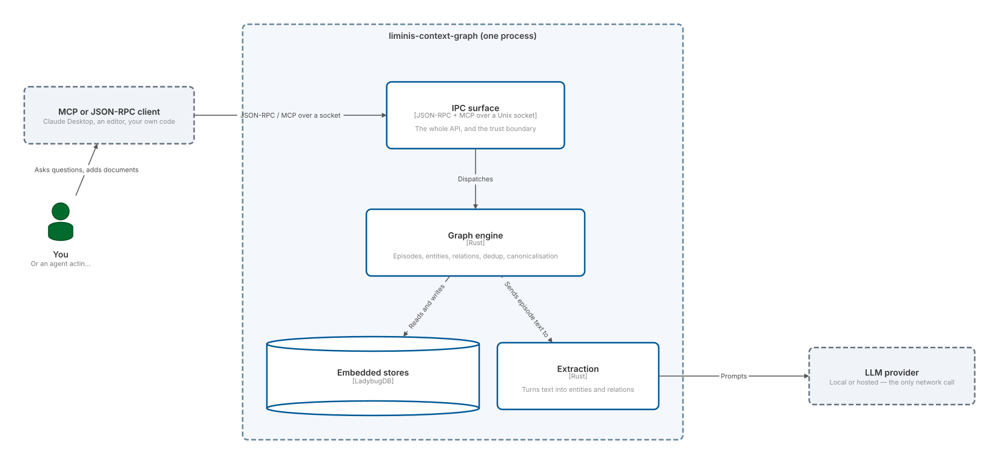

# liminis-context-graph

A local-first context graph engine. One Rust binary that turns a stream of text into a
queryable graph of entities, relationships, and episodes — combining property-graph storage,
HNSW vector search, and full-text search in a single embedded service, built on
[LadybugDB](https://github.com/lbugdb/lbug). No database server, no separate vector store, no
search cluster: everything runs in one process, on your machine, against files in your
workspace.

This page documents **v{{ site.version }}**, built directly from that release tag's `docs/`
tree — not from `main`. Unreleased changes merged to `main` since this tag are not reflected
here; use the version switcher in the footer to browse other published releases.

Source: [github.com/{{ site.repository }}](https://github.com/{{ site.repository }}). The
[`README`](https://github.com/{{ site.repository }}/blob/main/README.md) has a short overview
and a standalone quickstart; this site is the full reference.

## How it fits together

One process, one socket, one database directory. A client speaks JSON-RPC (or MCP)
over a Unix socket; extraction calls out to an LLM; everything else — graph storage,
vector index, full-text search, the write-ahead log — is embedded.

```c4 static height=26rem
Person(user, "You", "Or an agent acting for you")
System_Ext(client, "MCP or JSON-RPC client", "Claude Desktop, an editor, your own code")

System_Boundary(proc, "liminis-context-graph (one process)") {
  Container(ipc, "IPC surface", "JSON-RPC + MCP over a Unix socket", "The whole API, and the trust boundary")
  Container(core, "Graph engine", "Rust", "Episodes, entities, relations, dedup, canonicalisation")
  Container(extract, "Extraction", "Rust", "Turns text into entities and relations")
  ContainerDb(store, "Embedded stores", "LadybugDB", "Property graph, HNSW vectors, full-text index, WAL")
}

System_Ext(llm, "LLM provider", "Local or hosted — the only network call")

Rel(user, client, "Asks questions, adds documents")
Rel(client, ipc, "JSON-RPC / MCP over a socket")
Rel(ipc, core, "Dispatches")
Rel(core, extract, "Sends episode text to")
Rel(extract, llm, "Prompts")
Rel(core, store, "Reads and writes")
```
<picture><source media="(prefers-color-scheme: dark)" srcset="./diagrams/index-1-dark.svg" /></picture>

Everything inside that boundary is one binary and files in a directory you own. The
only arrow leaving it is the LLM call, and a local model keeps even that on your
machine.

**Multi-graph, not multi-tenant.** One process can hold many graphs, each with its own `group_id`
and its own WAL stream — see [IPC & MCP Reference: group_ids semantics](ipc-mcp-reference.md#group_ids-semantics-omitted-vs-empty)
and [Operations](operations.md) for the mechanics. That's a data-organisation capability for one
user's own workspaces and subscriptions, not tenancy: there is no authentication, no
authorisation, and no per-tenant resource isolation. Anything that can reach the socket can reach
every group in the database — treat the process boundary as the trust boundary.

## Reference pages

- **[Getting Started](getting-started.md)** — install, run, build from source, bundle in downstream apps.
- **[Configuration](configuration.md)** — every environment variable and CLI flag.
- **[IPC & MCP Reference](ipc-mcp-reference.md)** — the JSON-RPC and Model Context Protocol method surface.
- **[Telemetry](telemetry.md)** — structured JSONL events emitted on stderr.
- **[Ontology](ontology.md)** — the optional entity/relation type vocabulary.
- **[Operations](operations.md)** — WAL administration, degraded mode, and self-healing recovery.
- **[Testing & Evaluation](testing-and-evaluation.md)** — LLM cassettes and the extraction-quality eval harness.
- **[Extraction-Quality Evaluation](extraction-quality-evaluation.md)** — evaluation methodology, model rankings, and local-LLM guidance.
- **[Full-Corpus Extraction Benchmark Runbook](eval-full-corpus-runbook.md)** — maintainer procedure for full-corpus model comparison.
- **[Release Process](release-process.md)** — maintainer procedure for verifying CI status before cutting a release.
- **[ADR Index](adr/index.md)** — architecture decision records (historical, not current-state, documentation — see the index for framing).

## llms.txt

[`llms.txt`](llms.txt) and [`llms-full.txt`](llms-full.txt) provide this site's content in a
form suited to LLM ingestion. `CLAUDE.md` (agent guidance for contributors working in this
repository) is referenced from `llms.txt` but is not itself published here.
